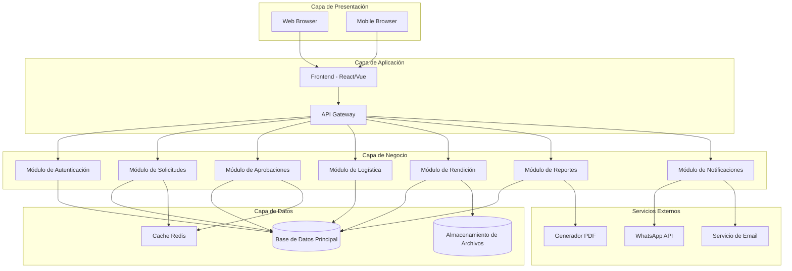
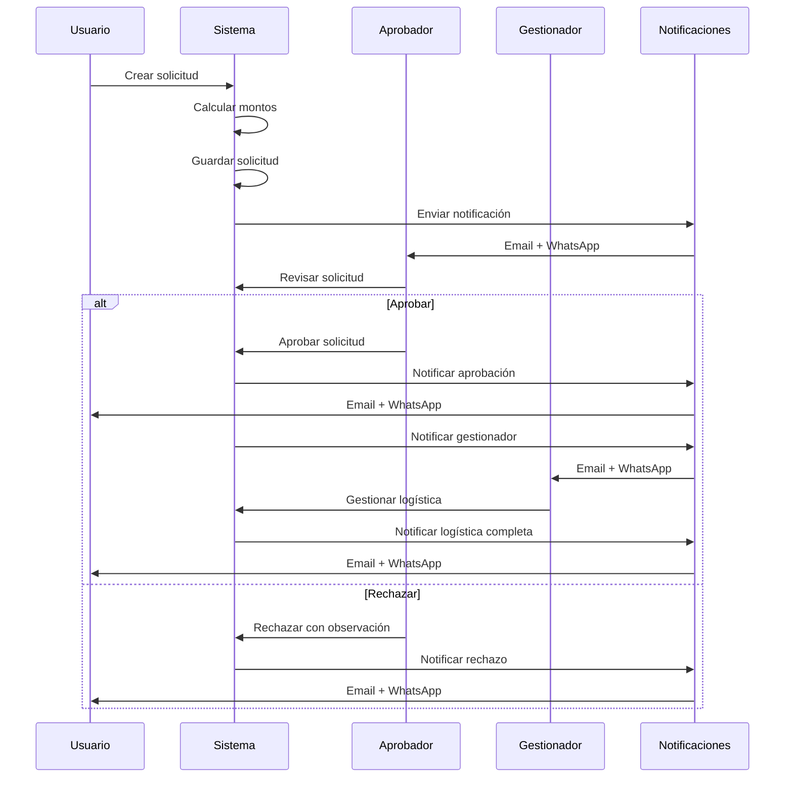
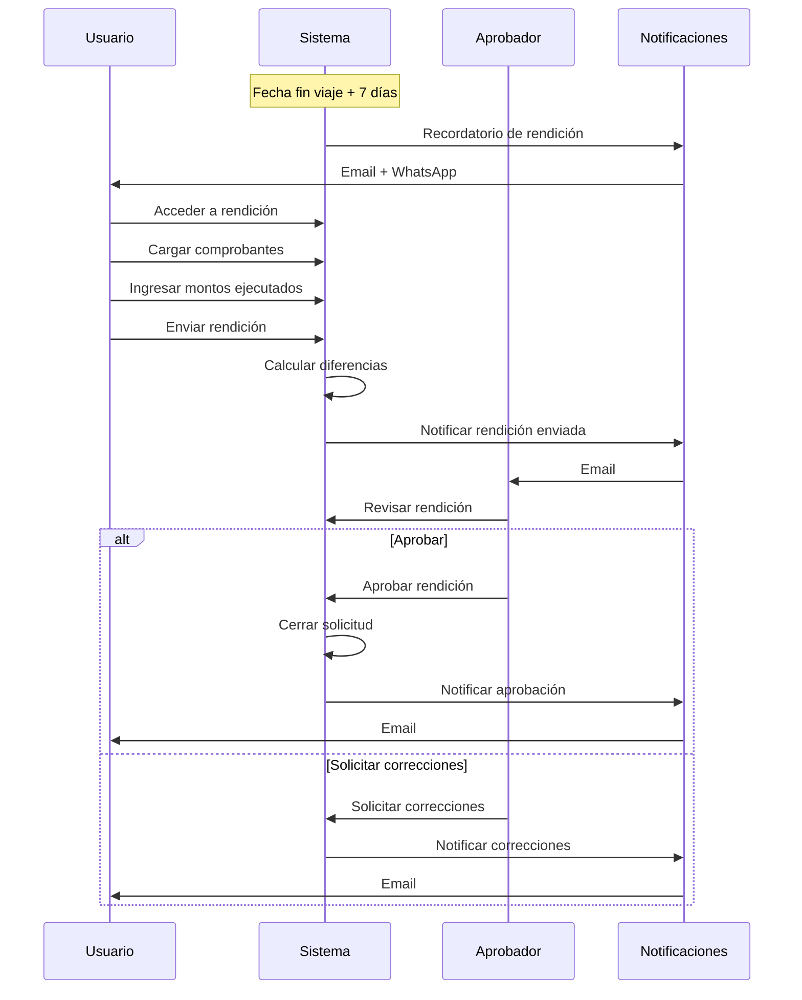

# PDR - Sistema de Gestión y Aprobación de Viáticos (VIAJERO)

## 1. Información General del Producto

### 1.1 Nombre del Producto
**VIAJERO** - Sistema de Gestión y Aprobación de Viáticos

### 1.2 Versión
1.0.0

### 1.3 Fecha
Enero 2026

### 1.4 Propósito
Automatizar el ciclo de vida completo de los viáticos empresariales, desde la solicitud inicial y aprobación financiera, hasta la gestión logística y la rendición de cuentas final, optimizando los procesos administrativos y mejorando la trazabilidad de los gastos.

### 1.5 Alcance
El sistema abarca:
- Gestión de usuarios y control de acceso basado en roles
- Solicitud y aprobación de viáticos
- Cálculo automático de montos con conversión de divisas
- Gestión logística de traslados y hospedajes
- Rendición de cuentas post-viaje
- Generación de reportes y notificaciones automáticas

---

## 2. Stakeholders

| Rol | Responsabilidad | Interés |
|-----|----------------|---------|
| **Empleados/Solicitantes** | Crear solicitudes de viáticos y rendir cuentas | Proceso ágil y transparente |
| **Aprobadores Administrativos** | Validar y autorizar presupuestos | Control financiero efectivo |
| **Gestionadores de Servicios** | Coordinar logística de viajes | Gestión eficiente de recursos |
| **Supervisores** | Aprobar solicitudes de equipo | Visibilidad de gastos del equipo |
| **Departamento Financiero** | Auditoría y control presupuestario | Trazabilidad y cumplimiento |
| **Departamento de TI** | Mantenimiento del sistema | Estabilidad y seguridad |

---

## 3. Requisitos Funcionales

### 3.1 Módulo de Seguridad y Acceso

#### RF-001: Gestión de Usuarios
**Prioridad:** Alta  
**Descripción:** El sistema debe permitir el registro y autenticación de usuarios.

**Criterios de Aceptación:**
- Cada empleado se registra con credenciales únicas (correo electrónico y contraseña)
- Las contraseñas deben almacenarse encriptadas (mínimo bcrypt o Argon2)
- Se debe capturar y almacenar el número de WhatsApp para notificaciones
- Validación de formato de correo electrónico
- Política de contraseñas: mínimo 8 caracteres, mayúsculas, minúsculas y números

#### RF-002: Jerarquía de Aprobación
**Prioridad:** Alta  
**Descripción:** Cada empleado debe estar vinculado a un supervisor.

**Criterios de Aceptación:**
- Campo obligatorio: ID de Supervisor en el perfil del empleado
- Validación de existencia del supervisor en la base de datos
- Prevención de ciclos jerárquicos (un empleado no puede ser supervisor de su propio supervisor)
- Interfaz para visualizar el árbol jerárquico

#### RF-003: Control de Acceso Basado en Roles (RBAC)
**Prioridad:** Alta  
**Descripción:** Implementar sistema de roles con permisos diferenciados.

**Roles definidos:**

| Rol | Permisos |
|-----|----------|
| **Usuario (Solicitante)** | - Crear solicitudes de viáticos<br>- Ver sus propias solicitudes<br>- Registrar relación de gastos<br>- Cargar facturas |
| **Aprobador Administrativo** | - Ver solicitudes pendientes<br>- Aprobar/rechazar solicitudes<br>- Ver histórico de aprobaciones<br>- Generar reportes financieros |
| **Gestionador de Servicios** | - Ver solicitudes aprobadas<br>- Gestionar logística (traslados/hospedaje)<br>- Marcar servicios como gestionados<br>- Coordinar con proveedores |
| **Administrador del Sistema** | - Gestión completa de usuarios<br>- Configuración de parámetros<br>- Acceso a todos los módulos |

**Criterios de Aceptación:**
- Un usuario puede tener múltiples roles
- Los permisos se validan en backend y frontend
- Registro de auditoría de acciones por rol

---

### 3.2 Configuración y Parámetros del Sistema

#### RF-004: Catálogo de Localidades
**Prioridad:** Alta  
**Descripción:** Gestionar destinos permitidos para viajes.

**Criterios de Aceptación:**
- Clasificación: Nacional / Internacional
- Campos: Código, Nombre, País, Estado/Provincia, Ciudad
- Funcionalidad CRUD para administradores
- Estado activo/inactivo para cada localidad
- Búsqueda y filtrado por tipo y nombre

#### RF-005: Tarifario de Servicios
**Prioridad:** Alta  
**Descripción:** Definir tipos de viáticos y sus costos base.

**Tipos de servicios:**
- **Alimentación:** Desayuno, Almuerzo, Cena
- **Traslados:** Terrestre Local, Terrestre Nacional, Aéreo Nacional, Aéreo Internacional
- **Hospedaje:** Por noche

**Criterios de Aceptación:**
- Costos expresados en USD ($)
- Versionado de tarifas con fecha de vigencia
- Histórico de cambios de tarifas
- Interfaz de administración para actualizar costos
- Validación de montos positivos

#### RF-006: Mesa de Cambio
**Prioridad:** Alta  
**Descripción:** Registro histórico de tasas de conversión USD/VES.

**Criterios de Aceptación:**
- Campos: Fecha de vigencia, Tasa USD/VES
- Una sola tasa activa por día
- Interfaz para registro manual de tasas
- Opción de integración con API externa de tasas (futuro)
- Validación: tasa debe ser mayor a cero
- Consulta de tasa por fecha específica

---

### 3.3 Flujo de Solicitud de Viáticos

#### RF-007: Formulario de Solicitud
**Prioridad:** Alta  
**Descripción:** Interfaz para crear solicitudes de viáticos.

**Campos del formulario:**

**Datos del Viaje:**
- Fecha de inicio del viaje (obligatorio)
- Fecha de fin del viaje (obligatorio)
- Destino (selección desde catálogo de localidades)
- Cantidad de personas (mínimo 1)
- Motivo del viaje (texto libre, obligatorio)

**Desglose de Conceptos:**
- Alimentación:
  - ☐ Desayuno (cantidad de días)
  - ☐ Almuerzo (cantidad de días)
  - ☐ Cena (cantidad de días)
- Traslados:
  - ☐ Terrestre Local
  - ☐ Terrestre Nacional
  - ☐ Aéreo Nacional
  - ☐ Aéreo Internacional
- Hospedaje:
  - ☐ Hospedaje (cantidad de noches)

**Criterios de Aceptación:**
- Validación: fecha de fin >= fecha de inicio
- Validación: al menos un concepto debe ser seleccionado
- Guardado como borrador antes de enviar
- Confirmación antes de envío final
- Generación automática de número de solicitud

#### RF-008: Cálculo Automático de Montos
**Prioridad:** Alta  
**Descripción:** Calcular el costo total de la solicitud.

**Fórmula:**
```
Total USD = Σ (Costo Unitario × Cantidad × Número de Personas)
Total VES = Total USD × Tasa de Cambio del Día
```

**Criterios de Aceptación:**
- Cálculo en tiempo real mientras se completa el formulario
- Visualización simultánea en USD y VES
- Desglose detallado por concepto
- Redondeo a 2 decimales para USD
- Redondeo a 2 decimales para VES
- Indicación clara de la tasa de cambio utilizada

#### RF-009: Envío de Solicitud
**Prioridad:** Alta  
**Descripción:** Proceso de envío y registro de solicitud.

**Criterios de Aceptación:**
- Validación completa del formulario antes de envío
- Asignación de estado "Pendiente de Aprobación"
- Registro de fecha y hora de creación
- Generación de número único de solicitud (formato: VIA-YYYY-NNNN)
- Notificación automática al Aprobador Administrativo
- Confirmación visual al usuario

---

### 3.4 Paneles de Gestión y Aprobación

#### RF-010: Panel de Aprobación Administrativa
**Prioridad:** Alta  
**Descripción:** Interfaz para aprobadores administrativos.

**Funcionalidades:**
- Lista de solicitudes pendientes de aprobación
- Filtros: por fecha, solicitante, destino, monto
- Vista detallada de cada solicitud con:
  - Datos del solicitante
  - Desglose completo de conceptos
  - Montos en USD y VES
  - Motivo del viaje
  - Historial de la solicitud

**Acciones disponibles:**
- **Aprobar:** Cambia estado a "Aprobada"
- **Rechazar:** Requiere observación obligatoria

**Criterios de Aceptación:**
- Ordenamiento por fecha de solicitud (más recientes primero)
- Indicadores visuales de urgencia (viajes próximos)
- Contador de solicitudes pendientes
- Validación: observación obligatoria en rechazo (mínimo 10 caracteres)
- Confirmación antes de aprobar/rechazar
- Registro de fecha, hora y usuario que aprobó/rechazó

#### RF-011: Panel de Gestión Logística
**Prioridad:** Alta  
**Descripción:** Interfaz para gestionadores de servicios.

**Funcionalidades:**
- Lista de solicitudes aprobadas pendientes de gestión
- Filtros: por fecha de viaje, tipo de servicio, destino
- Vista detallada de requerimientos logísticos:
  - Traslados solicitados
  - Hospedaje requerido
  - Fechas y destinos
  - Cantidad de personas

**Acciones disponibles:**
- Marcar traslado como "Gestionado"
- Marcar hospedaje como "Gestionado"
- Agregar notas de coordinación (proveedor, número de reserva, etc.)

**Criterios de Aceptación:**
- Separación visual entre servicios gestionados y pendientes
- Indicadores de urgencia (viajes en menos de 7 días)
- Campo de notas para cada servicio
- Cambio de estado a "Logística Completa" cuando todos los servicios estén gestionados
- Notificación al solicitante cuando la logística esté completa

---

### 3.5 Rendición de Cuentas

#### RF-012: Panel de Rendición de Gastos
**Prioridad:** Alta  
**Descripción:** Interfaz para que el usuario rinda cuentas post-viaje.

**Funcionalidades:**
- Lista de viajes completados pendientes de rendición
- Formulario de rendición por cada concepto:
  - Monto solicitado (solo lectura)
  - Monto ejecutado (editable)
  - Carga de factura/comprobante (PDF, JPG, PNG - máx 5MB)
  - Observaciones (opcional)

**Criterios de Aceptación:**
- Habilitación automática después de la fecha de fin del viaje
- Validación de formato de archivo
- Validación de tamaño de archivo
- Cálculo automático de diferencias (solicitado vs ejecutado)
- Indicador visual de:
  - ✅ Gasto dentro del presupuesto
  - ⚠️ Gasto superior al presupuesto
  - 💰 Ahorro (gasto menor)
- Obligatoriedad de carga de al menos un comprobante por concepto
- Estado "Pendiente de Revisión" al enviar rendición

#### RF-013: Revisión de Rendición
**Prioridad:** Media  
**Descripción:** Proceso de revisión de gastos rendidos.

**Criterios de Aceptación:**
- Panel para Aprobador Administrativo
- Visualización de comprobantes cargados
- Comparación solicitado vs ejecutado
- Aprobación o solicitud de correcciones
- Cierre definitivo de la solicitud al aprobar rendición

---

### 3.6 Módulo de Reportes y Notificaciones

#### RF-014: Generación de Reportes PDF
**Prioridad:** Alta  
**Descripción:** Generación automática de documentos formales.

**Formatos requeridos:**

**1. Formato de Solicitud de Viáticos**
- Encabezado con logo y datos de la empresa
- Número de solicitud
- Datos del solicitante
- Datos del viaje
- Desglose de conceptos y montos
- Firmas: Solicitante, Supervisor, Aprobador
- Fecha de generación

**2. Formato de Relación de Gastos Final**
- Encabezado con logo y datos de la empresa
- Número de solicitud
- Datos del solicitante
- Tabla comparativa:
  - Concepto
  - Monto Solicitado
  - Monto Ejecutado
  - Diferencia
  - Comprobante adjunto (referencia)
- Totales y resumen
- Firmas: Solicitante, Aprobador
- Fecha de generación

**Criterios de Aceptación:**
- Generación en formato PDF/A (archivo)
- Diseño profesional y legible
- Opción de descarga y envío por correo
- Marca de agua con estado del documento
- Generación en menos de 5 segundos

#### RF-015: Sistema de Notificaciones
**Prioridad:** Alta  
**Descripción:** Alertas automáticas por WhatsApp y correo electrónico.

**Eventos que generan notificaciones:**

| Evento | Destinatario | Canal |
|--------|-------------|-------|
| Solicitud creada | Aprobador Administrativo | Email + WhatsApp |
| Solicitud aprobada | Solicitante | Email + WhatsApp |
| Solicitud rechazada | Solicitante | Email + WhatsApp |
| Logística completa | Solicitante | Email + WhatsApp |
| Recordatorio de rendición | Solicitante (7 días post-viaje) | Email + WhatsApp |
| Rendición enviada | Aprobador Administrativo | Email |
| Rendición aprobada | Solicitante | Email |

**Criterios de Aceptación:**
- Integración con API de WhatsApp Business
- Plantillas de mensajes personalizables
- Configuración de preferencias de notificación por usuario
- Registro de notificaciones enviadas (log)
- Reintento automático en caso de fallo (máx 3 intentos)
- Opción de desactivar notificaciones por canal

---

## 4. Requisitos No Funcionales

### 4.1 Rendimiento

#### RNF-001: Tiempo de Respuesta
- Las páginas deben cargar en menos de 2 segundos
- Las consultas a base de datos deben ejecutarse en menos de 1 segundo
- La generación de PDF debe completarse en menos de 5 segundos

#### RNF-002: Capacidad
- Soporte para al menos 500 usuarios concurrentes
- Capacidad de almacenar 10,000 solicitudes por año
- Almacenamiento de archivos: mínimo 100GB

#### RNF-003: Disponibilidad
- Disponibilidad del sistema: 99.5% (tiempo de inactividad máximo: 3.6 horas/mes)
- Ventana de mantenimiento: Domingos 2:00 AM - 6:00 AM

---

### 4.2 Seguridad

#### RNF-004: Autenticación y Autorización
- Encriptación de contraseñas con bcrypt (cost factor mínimo 12)
- Sesiones con timeout de 30 minutos de inactividad
- Tokens JWT para autenticación de API
- Validación de permisos en cada endpoint

#### RNF-005: Protección de Datos
- Comunicación HTTPS obligatoria (TLS 1.3)
- Encriptación de datos sensibles en base de datos
- Cumplimiento con GDPR/LOPD para datos personales
- Backup diario de base de datos con retención de 30 días

#### RNF-006: Auditoría
- Registro de todas las acciones críticas:
  - Creación/modificación/eliminación de solicitudes
  - Aprobaciones/rechazos
  - Cambios en configuración
  - Accesos al sistema
- Logs inmutables con timestamp y usuario
- Retención de logs: mínimo 2 años

---

### 4.3 Usabilidad

#### RNF-007: Interfaz de Usuario
- Diseño responsive (mobile-first)
- Compatibilidad con navegadores: Chrome, Firefox, Safari, Edge (últimas 2 versiones)
- Accesibilidad WCAG 2.1 nivel AA
- Idioma: Español (con arquitectura para internacionalización)

#### RNF-008: Experiencia de Usuario
- Mensajes de error claros y accionables
- Confirmaciones para acciones destructivas
- Indicadores de progreso para operaciones largas
- Ayuda contextual en formularios

---

### 4.4 Mantenibilidad

#### RNF-009: Código
- Documentación de código (comentarios en funciones críticas)
- Cobertura de pruebas unitarias: mínimo 70%
- Estándares de codificación (PEP 8 para Python, ESLint para JavaScript)
- Versionado semántico (SemVer)

#### RNF-010: Despliegue
- Entorno de desarrollo, staging y producción separados
- Proceso de CI/CD automatizado
- Rollback automático en caso de fallo
- Documentación de procedimientos de despliegue

---

### 4.5 Escalabilidad

#### RNF-011: Arquitectura
- Diseño modular y desacoplado
- API RESTful para integraciones futuras
- Base de datos normalizada
- Caché para consultas frecuentes (Redis)

#### RNF-012: Crecimiento
- Capacidad de agregar nuevos roles sin modificar código base
- Configuración de nuevos tipos de viáticos vía interfaz
- Soporte para múltiples monedas (preparación futura)

---

## 5. Modelo de Datos

### 5.1 Entidades Principales

#### Usuarios
```
- id (PK)
- email (unique)
- password_hash
- nombre
- apellido
- whatsapp
- supervisor_id (FK -> Usuarios)
- activo
- fecha_creacion
- fecha_modificacion
```

#### Roles
```
- id (PK)
- nombre (Usuario, Aprobador Administrativo, Gestionador de Servicios, Administrador)
- descripcion
```

#### Usuario_Roles
```
- usuario_id (FK)
- rol_id (FK)
- fecha_asignacion
```

#### Localidades
```
- id (PK)
- codigo
- nombre
- pais
- estado_provincia
- ciudad
- tipo (Nacional/Internacional)
- activo
```

#### Tarifario_Servicios
```
- id (PK)
- tipo_servicio (Alimentación, Traslado, Hospedaje)
- subtipo (Desayuno, Almuerzo, Cena, Terrestre Local, etc.)
- costo_usd
- fecha_vigencia_inicio
- fecha_vigencia_fin
- activo
```

#### Mesa_Cambio
```
- id (PK)
- fecha
- tasa_usd_ves
- activo
```

#### Solicitudes
```
- id (PK)
- numero_solicitud (unique)
- usuario_id (FK)
- fecha_inicio_viaje
- fecha_fin_viaje
- localidad_id (FK)
- cantidad_personas
- motivo
- estado (Borrador, Pendiente, Aprobada, Rechazada, Logística Completa, Finalizada)
- total_usd
- total_ves
- tasa_cambio_utilizada
- fecha_creacion
- fecha_modificacion
- aprobador_id (FK -> Usuarios)
- fecha_aprobacion
- observaciones_aprobacion
```

#### Solicitud_Conceptos
```
- id (PK)
- solicitud_id (FK)
- tarifario_servicio_id (FK)
- cantidad
- costo_unitario_usd
- subtotal_usd
```

#### Gestion_Logistica
```
- id (PK)
- solicitud_id (FK)
- tipo_servicio (Traslado/Hospedaje)
- gestionado
- gestionador_id (FK -> Usuarios)
- fecha_gestion
- notas
```

#### Rendicion_Gastos
```
- id (PK)
- solicitud_id (FK)
- concepto_id (FK -> Solicitud_Conceptos)
- monto_ejecutado_usd
- archivo_comprobante
- observaciones
- estado (Pendiente, Aprobada, Rechazada)
- fecha_carga
- revisor_id (FK -> Usuarios)
- fecha_revision
```

#### Notificaciones_Log
```
- id (PK)
- usuario_id (FK)
- tipo_evento
- canal (Email/WhatsApp)
- mensaje
- enviado
- fecha_envio
- intentos
```

#### Auditoria
```
- id (PK)
- usuario_id (FK)
- accion
- entidad
- entidad_id
- datos_anteriores (JSON)
- datos_nuevos (JSON)
- ip_address
- timestamp
```

---

## 6. Arquitectura del Sistema

### 6.1 Arquitectura General



### 6.2 Stack Tecnológico Recomendado

#### Backend
- **Lenguaje:** Python 3.11+
- **Framework:** FastAPI o Django REST Framework
- **ORM:** SQLAlchemy o Django ORM
- **Base de Datos:** PostgreSQL 15+
- **Cache:** Redis 7+
- **Autenticación:** JWT (PyJWT)

#### Frontend
- **Framework:** React 18+ o Vue 3+
- **UI Library:** Material-UI o Ant Design
- **Estado:** Redux o Pinia
- **HTTP Client:** Axios
- **Validación:** Yup o Vuelidate

#### Infraestructura
- **Servidor Web:** Nginx
- **WSGI/ASGI:** Gunicorn + Uvicorn
- **Contenedores:** Docker + Docker Compose
- **CI/CD:** GitHub Actions o GitLab CI
- **Monitoreo:** Prometheus + Grafana

#### Servicios
- **Email:** SendGrid o Amazon SES
- **WhatsApp:** Twilio API o WhatsApp Business API
- **PDF:** WeasyPrint o ReportLab
- **Almacenamiento:** AWS S3 o MinIO

---

## 7. Flujos de Trabajo Principales

### 7.1 Flujo de Solicitud y Aprobación



### 7.2 Flujo de Rendición de Cuentas



---

## 8. Casos de Uso Principales

### 8.1 CU-001: Crear Solicitud de Viático

**Actor Principal:** Usuario (Solicitante)

**Precondiciones:**
- Usuario autenticado
- Usuario tiene rol de "Usuario"

**Flujo Principal:**
1. Usuario accede al módulo de solicitudes
2. Sistema muestra formulario de nueva solicitud
3. Usuario ingresa datos del viaje (fechas, destino, personas, motivo)
4. Usuario selecciona conceptos de viáticos (alimentación, traslados, hospedaje)
5. Sistema calcula automáticamente los montos en USD y VES
6. Usuario revisa el resumen
7. Usuario envía la solicitud
8. Sistema valida los datos
9. Sistema genera número de solicitud
10. Sistema cambia estado a "Pendiente de Aprobación"
11. Sistema envía notificación al Aprobador Administrativo
12. Sistema muestra confirmación al usuario

**Flujos Alternativos:**
- **8a.** Datos inválidos:
  - Sistema muestra mensajes de error
  - Usuario corrige los datos
  - Continúa en paso 7

**Postcondiciones:**
- Solicitud creada en estado "Pendiente de Aprobación"
- Notificación enviada al aprobador

---

### 8.2 CU-002: Aprobar/Rechazar Solicitud

**Actor Principal:** Aprobador Administrativo

**Precondiciones:**
- Usuario autenticado
- Usuario tiene rol de "Aprobador Administrativo"
- Existe al menos una solicitud pendiente

**Flujo Principal:**
1. Aprobador accede al panel de aprobaciones
2. Sistema muestra lista de solicitudes pendientes
3. Aprobador selecciona una solicitud
4. Sistema muestra detalles completos
5. Aprobador revisa la información
6. Aprobador decide aprobar
7. Aprobador confirma la aprobación
8. Sistema cambia estado a "Aprobada"
9. Sistema registra fecha, hora y aprobador
10. Sistema envía notificación al solicitante
11. Sistema envía notificación al Gestionador de Servicios
12. Sistema muestra confirmación

**Flujos Alternativos:**
- **6a.** Aprobador decide rechazar:
  - Aprobador selecciona "Rechazar"
  - Sistema solicita observación obligatoria
  - Aprobador ingresa observación (mínimo 10 caracteres)
  - Aprobador confirma el rechazo
  - Sistema cambia estado a "Rechazada"
  - Sistema registra observación, fecha, hora y aprobador
  - Sistema envía notificación al solicitante con observación
  - Sistema muestra confirmación

**Postcondiciones:**
- Solicitud aprobada o rechazada
- Notificaciones enviadas
- Registro de auditoría creado

---

### 8.3 CU-003: Gestionar Logística

**Actor Principal:** Gestionador de Servicios

**Precondiciones:**
- Usuario autenticado
- Usuario tiene rol de "Gestionador de Servicios"
- Existe al menos una solicitud aprobada

**Flujo Principal:**
1. Gestionador accede al panel de logística
2. Sistema muestra solicitudes aprobadas pendientes
3. Gestionador selecciona una solicitud
4. Sistema muestra requerimientos logísticos (traslados, hospedaje)
5. Gestionador coordina servicios con proveedores
6. Gestionador marca servicio como "Gestionado"
7. Gestionador ingresa notas (proveedor, reserva, etc.)
8. Sistema guarda la información
9. Si todos los servicios están gestionados:
   - Sistema cambia estado a "Logística Completa"
   - Sistema envía notificación al solicitante
10. Sistema muestra confirmación

**Postcondiciones:**
- Servicios marcados como gestionados
- Notas de coordinación guardadas
- Notificación enviada si logística completa

---

### 8.4 CU-004: Rendir Cuentas

**Actor Principal:** Usuario (Solicitante)

**Precondiciones:**
- Usuario autenticado
- Viaje finalizado (fecha fin < fecha actual)
- Solicitud en estado "Logística Completa"

**Flujo Principal:**
1. Usuario accede al módulo de rendición
2. Sistema muestra viajes pendientes de rendición
3. Usuario selecciona un viaje
4. Sistema muestra formulario de rendición con conceptos solicitados
5. Para cada concepto:
   - Usuario ingresa monto ejecutado
   - Usuario carga comprobante (PDF/JPG/PNG)
   - Usuario agrega observaciones (opcional)
6. Sistema valida archivos y montos
7. Sistema calcula diferencias (solicitado vs ejecutado)
8. Usuario revisa el resumen
9. Usuario envía la rendición
10. Sistema cambia estado a "Pendiente de Revisión"
11. Sistema envía notificación al Aprobador Administrativo
12. Sistema muestra confirmación

**Flujos Alternativos:**
- **6a.** Archivo inválido:
  - Sistema muestra error (formato o tamaño)
  - Usuario carga archivo correcto
  - Continúa en paso 6

**Postcondiciones:**
- Rendición registrada
- Comprobantes almacenados
- Notificación enviada al aprobador

---

## 9. Interfaz de Usuario (Wireframes Conceptuales)

### 9.1 Dashboard Principal

```
┌─────────────────────────────────────────────────────────────┐
│ VIAJERO                                    [Usuario] [Salir] │
├─────────────────────────────────────────────────────────────┤
│                                                               │
│  Mis Solicitudes  │  Aprobaciones  │  Logística  │  Reportes│
│                                                               │
├─────────────────────────────────────────────────────────────┤
│                                                               │
│  📊 Resumen                                                  │
│  ┌──────────────┐  ┌──────────────┐  ┌──────────────┐      │
│  │ Pendientes   │  │ Aprobadas    │  │ Finalizadas  │      │
│  │      5       │  │      12      │  │      48      │      │
│  └──────────────┘  └──────────────┘  └──────────────┘      │
│                                                               │
│  📝 Solicitudes Recientes                                    │
│  ┌─────────────────────────────────────────────────────┐    │
│  │ VIA-2026-0123  │  Caracas  │  $450  │  Pendiente   │    │
│  │ VIA-2026-0122  │  Valencia │  $320  │  Aprobada    │    │
│  │ VIA-2026-0121  │  Maracay  │  $280  │  Finalizada  │    │
│  └─────────────────────────────────────────────────────┘    │
│                                                               │
│  [+ Nueva Solicitud]                                         │
│                                                               │
└─────────────────────────────────────────────────────────────┘
```

### 9.2 Formulario de Solicitud

```
┌─────────────────────────────────────────────────────────────┐
│ Nueva Solicitud de Viático                          [Cerrar] │
├─────────────────────────────────────────────────────────────┤
│                                                               │
│  Datos del Viaje                                             │
│  ┌─────────────────────────────────────────────────────┐    │
│  │ Fecha Inicio: [__/__/____]  Fecha Fin: [__/__/____]│    │
│  │ Destino: [Seleccionar localidad ▼]                 │    │
│  │ Cantidad de personas: [___]                         │    │
│  │ Motivo: [________________________________]          │    │
│  └─────────────────────────────────────────────────────┘    │
│                                                               │
│  Conceptos de Viáticos                                       │
│  ┌─────────────────────────────────────────────────────┐    │
│  │ Alimentación:                                        │    │
│  │ ☐ Desayuno  Días: [__]  $20/día  = $___            │    │
│  │ ☐ Almuerzo  Días: [__]  $30/día  = $___            │    │
│  │ ☐ Cena      Días: [__]  $25/día  = $___            │    │
│  │                                                      │    │
│  │ Traslados:                                           │    │
│  │ ☐ Terrestre Local      $15  = $___                  │    │
│  │ ☐ Terrestre Nacional   $50  = $___                  │    │
│  │ ☐ Aéreo Nacional      $150  = $___                  │    │
│  │                                                      │    │
│  │ Hospedaje:                                           │    │
│  │ ☐ Hospedaje  Noches: [__]  $80/noche = $___        │    │
│  └─────────────────────────────────────────────────────┘    │
│                                                               │
│  Resumen                                                     │
│  ┌─────────────────────────────────────────────────────┐    │
│  │ Total USD: $___.__                                   │    │
│  │ Tasa: 1 USD = __.__ VES                             │    │
│  │ Total VES: Bs. _____.__                             │    │
│  └─────────────────────────────────────────────────────┘    │
│                                                               │
│  [Guardar Borrador]  [Enviar Solicitud]                     │
│                                                               │
└─────────────────────────────────────────────────────────────┘
```

### 9.3 Panel de Aprobaciones

```
┌─────────────────────────────────────────────────────────────┐
│ Panel de Aprobaciones                                        │
├─────────────────────────────────────────────────────────────┤
│                                                               │
│  Filtros: [Todos ▼] [Fecha ▼] [Monto ▼]        🔍 [Buscar] │
│                                                               │
│  Solicitudes Pendientes (8)                                  │
│  ┌─────────────────────────────────────────────────────┐    │
│  │ VIA-2026-0125                          🔴 Urgente   │    │
│  │ Juan Pérez  │  Caracas  │  15-20 Ene  │  $450      │    │
│  │ Motivo: Reunión con clientes                        │    │
│  │ [Ver Detalles] [Aprobar] [Rechazar]                │    │
│  ├─────────────────────────────────────────────────────┤    │
│  │ VIA-2026-0124                                       │    │
│  │ María García │ Valencia  │  22-24 Ene  │  $320      │    │
│  │ Motivo: Capacitación técnica                        │    │
│  │ [Ver Detalles] [Aprobar] [Rechazar]                │    │
│  └─────────────────────────────────────────────────────┘    │
│                                                               │
│  Historial de Aprobaciones                                   │
│  [Ver Historial]                                             │
│                                                               │
└─────────────────────────────────────────────────────────────┘
```

---

## 10. Plan de Pruebas

### 10.1 Pruebas Unitarias
- Validación de cálculos de montos
- Encriptación de contraseñas
- Conversión de divisas
- Validación de formularios
- Generación de números de solicitud

### 10.2 Pruebas de Integración
- Flujo completo de solicitud y aprobación
- Envío de notificaciones
- Generación de PDFs
- Carga y almacenamiento de archivos
- Integración con APIs externas

### 10.3 Pruebas de Sistema
- Rendimiento bajo carga
- Seguridad (penetración básica)
- Compatibilidad de navegadores
- Responsive design
- Accesibilidad

### 10.4 Pruebas de Aceptación
- Validación con usuarios finales
- Casos de uso reales
- Usabilidad
- Documentación de usuario

---

## 11. Plan de Implementación

### Fase 1: Fundamentos (4 semanas)
- ✅ Configuración de entorno de desarrollo
- ✅ Diseño de base de datos
- ✅ Implementación de autenticación
- ✅ Módulo de gestión de usuarios
- ✅ Sistema de roles y permisos

### Fase 2: Configuración (3 semanas)
- ✅ Catálogo de localidades
- ✅ Tarifario de servicios
- ✅ Mesa de cambio
- ✅ Interfaces de administración

### Fase 3: Solicitudes (4 semanas)
- ✅ Formulario de solicitud
- ✅ Cálculo automático de montos
- ✅ Panel de usuario
- ✅ Validaciones

### Fase 4: Aprobaciones y Logística (3 semanas)
- ✅ Panel de aprobaciones
- ✅ Flujo de aprobación/rechazo
- ✅ Panel de gestión logística
- ✅ Notificaciones básicas

### Fase 5: Rendición (3 semanas)
- ✅ Panel de rendición
- ✅ Carga de comprobantes
- ✅ Revisión de rendición
- ✅ Cierre de solicitudes

### Fase 6: Reportes y Notificaciones (3 semanas)
- ✅ Generación de PDFs
- ✅ Integración WhatsApp
- ✅ Sistema de notificaciones completo
- ✅ Reportes adicionales

### Fase 7: Pruebas y Despliegue (2 semanas)
- ✅ Pruebas integrales
- ✅ Corrección de bugs
- ✅ Documentación
- ✅ Capacitación
- ✅ Despliegue a producción

**Duración Total Estimada:** 22 semanas (~5.5 meses)

---

## 12. Riesgos y Mitigaciones

| Riesgo | Probabilidad | Impacto | Mitigación |
|--------|-------------|---------|------------|
| Integración con WhatsApp API falla | Media | Alto | Implementar sistema de email como backup; considerar múltiples proveedores de WhatsApp API |
| Cambios frecuentes en tasas de cambio | Alta | Medio | Implementar actualización manual diaria; preparar integración con API externa |
| Usuarios no cargan comprobantes correctamente | Alta | Medio | Validación estricta de archivos; tutoriales en video; mensajes de ayuda claros |
| Sobrecarga del sistema en períodos de alta demanda | Media | Alto | Implementar caché; optimizar consultas; considerar escalado horizontal |
| Pérdida de datos por fallo de servidor | Baja | Crítico | Backups automáticos diarios; replicación de base de datos; plan de recuperación |
| Rechazo de usuarios por complejidad | Media | Alto | Diseño UX intuitivo; capacitación; soporte técnico; iteraciones basadas en feedback |
| Retrasos en desarrollo | Media | Medio | Metodología ágil; sprints cortos; priorización clara; equipo con experiencia |

---

## 13. Métricas de Éxito

### 13.1 Métricas de Adopción
- **Objetivo:** 80% de usuarios activos en los primeros 3 meses
- **Medición:** Usuarios que han creado al menos una solicitud

### 13.2 Métricas de Eficiencia
- **Objetivo:** Reducción del 60% en tiempo de procesamiento de solicitudes
- **Medición:** Tiempo promedio desde solicitud hasta aprobación

### 13.3 Métricas de Calidad
- **Objetivo:** 95% de solicitudes aprobadas en primer intento
- **Medición:** Ratio de aprobaciones vs rechazos

### 13.4 Métricas de Satisfacción
- **Objetivo:** NPS (Net Promoter Score) > 50
- **Medición:** Encuesta trimestral a usuarios

### 13.5 Métricas Técnicas
- **Objetivo:** Disponibilidad > 99.5%
- **Objetivo:** Tiempo de respuesta promedio < 2 segundos
- **Medición:** Monitoreo continuo con Prometheus/Grafana

---

## 14. Glosario

| Término | Definición |
|---------|-----------|
| **Viático** | Asignación de dinero para cubrir gastos de alimentación, transporte y alojamiento durante un viaje de trabajo |
| **Rendición de Cuentas** | Proceso de justificar los gastos realizados mediante comprobantes y facturas |
| **Aprobador Administrativo** | Persona responsable de validar y autorizar el presupuesto de las solicitudes de viáticos |
| **Gestionador de Servicios** | Persona encargada de coordinar la logística de traslados y hospedajes |
| **Mesa de Cambio** | Tabla que registra las tasas de conversión de divisas (USD a VES) |
| **RBAC** | Role-Based Access Control - Control de acceso basado en roles |
| **JWT** | JSON Web Token - Estándar para autenticación basada en tokens |
| **NPS** | Net Promoter Score - Métrica de satisfacción del cliente |

---

## 15. Referencias

### 15.1 Documentos Relacionados
- Especificación Técnica Original
- Manual de Usuario (a desarrollar)
- Guía de Administración (a desarrollar)
- API Documentation (a desarrollar)

### 15.2 Estándares y Normativas
- WCAG 2.1 - Web Content Accessibility Guidelines
- GDPR - General Data Protection Regulation
- OWASP Top 10 - Seguridad en aplicaciones web
- ISO/IEC 27001 - Gestión de seguridad de la información

---

## 16. Aprobaciones

| Rol | Nombre | Firma | Fecha |
|-----|--------|-------|-------|
| **Product Owner** | | | |
| **Arquitecto de Software** | | | |
| **Líder Técnico** | | | |
| **Gerente de Proyecto** | | | |
| **Stakeholder Financiero** | | | |

---

## 17. Control de Versiones

| Versión | Fecha | Autor | Cambios |
|---------|-------|-------|---------|
| 1.0.0 | Enero 2026 | Equipo de Desarrollo | Versión inicial del PDR |

---

**Fin del Documento**
